# 🚀 DonkeyCar MLOps 통합 관리 시스템 (C#)
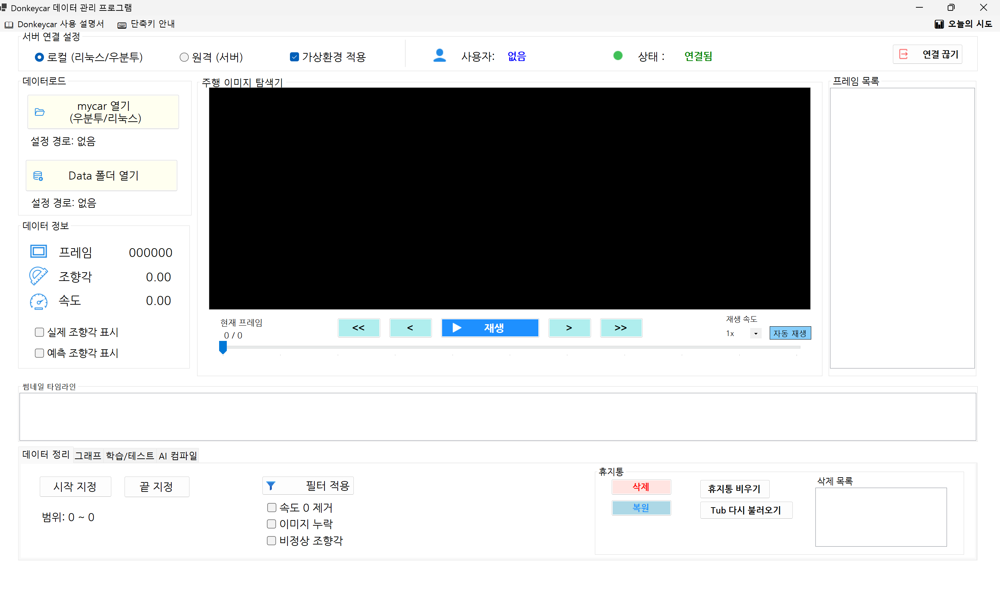    
> DonkeyCar 주행 데이터 관리, AI 학습, 모델 테스트를
C# Windows Forms GUI에서 통합 관리하는 프로젝트입니다.

-----------------------------------------------------------------------------------------------------------------------------------

## 📌 프로젝트 소개
> 본 프로젝트는 DonkeyCar 기반 자율주행 AI 학습 과정을
터미널 명령어 없이 GUI 환경에서 쉽게 관리하기 위해 개발되었습니다.

> 사용자는 C# Windows Forms 화면에서
Tub 데이터 불러오기, 프레임 탐색, 데이터 필터링, 학습 실행, 모델 테스트까지
한 번에 수행할 수 있습니다.

-----------------------------------------------------------------------------------------------------------------------------------

## 🎯 개발 목표
### 🚗 DonkeyCar 데이터 관리 자동화
  - Tub 데이터 시각화
  - 프레임 단위 탐색
  - 썸네일 기반 데이터 검토
  - 데이터 정리 및 필터링 ( 휴지통 복원 기능 )

### 🤖 AI 학습 환경 통합
  - AI 모델 학습
  - 실시간 로그 확인
  - 진행률 표시
  - Loss 그래프 분석

### 🧪 모델 테스트 및 검증
  - 테스트 이미지 폴더 선택
  - 실제 조향각 vs 예측 조향각 비교
  - 오차 분석
  - 오차가 큰 데이터 추출

### 🎨 사용자 친화적 GUI 제공
  - 직관적인 화면 구성
  - 초보자 가이드 제공 + 단축키 지원
  - 단계별 작업 흐름 안내
  - 오류 메시지 및 가이드 팝업

-----------------------------------------------------------------------------------------------------------------------------------

## ⚙️ 개발 환경

| 항목 | 내용 |
|------|------|
| 💻 Language | C# |
| 🖼️ Framework | .NET Windows Forms |
| 🧩 Target Framework | .NET 10.0 Windows (`net10.0-windows`) |
| 🤖 AI Framework | DonkeyCar v5.3.dev1 |
| 🧠 TensorFlow | TensorFlow 2.x |
| 🐍 Python | Python 3.11 계열 (`e2e_env`) |
| 🌐 Remote | SSH.NET 2025.1.0 |
| 📂 Data Format | catalog_*.catalog / record_*.json |
| 🧠 Model Format | .h5 |
| 🖥️ OS | Windows 10 Home 22H2 / Ubuntu 22.04 |
| 🐧 WSL | Ubuntu-22.04 |
| 🔨 IDE | Visual Studio 2022 |

-----------------------------------------------------------------------------------------------------------------------------------
## 🔄 전체 작업 흐름

DonkeyCar 데이터 폴더 열기

⬇️

주행 데이터 확인

⬇️

데이터 정리

⬇️

AI 모델 학습

⬇️

모델 테스트

⬇️

AI 컴파일

⬇️

오차가 큰 데이터 분석

-----------------------------------------------------------------------------------------------------------------------------------
## 🖥️ 전체 UI 화면
> 본 프로그램은 DonkeyCar 데이터 관리부터 AI 학습 및 모델 테스트까지 하나의 화면에서 수행할 수 있도록 설계되었습니다.

### 📍 화면 구성
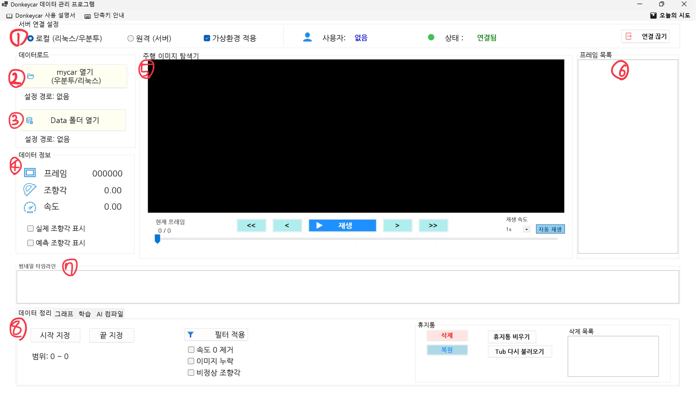

#### ① 서버 연결 설정
> 로컬 환경 또는 원격 서버 환경을 선택하여 작업할 수 있습니다.
##### 지원 기능
- 로컬 모드(리눅스, 우분투) 
- 원격 모드(SSH 접속)
- 가상환경 사용 여부 설정
- 로그아웃 기능

#### ② 설정 파일 열기
> DonkeyCar 프로젝트의 설정 파일을 선택하여 데이터를 불러옵니다.

##### 지원 기능
- manage.py가 포함된 mycar 폴더 선택 `(manage.py 자동 확인)`
- WSL 경로 지원 (예: `\\wsl$\Ubuntu\home\사용자명\mycar`)
- 원격 경로 자동 설정 (예: `/home/사용자명/mycar`)

#### ③ Tub 데이터 열기
> DonkeyCar 주행 데이터 폴더를 선택하여 프레임 정보를 불러옵니다.

##### 지원 기능
- `catalog_*.catalog` 또는 `record_*.json` 형식 지원 (신버전/구버전 모두 지원)
- 하위 폴더까지 자동 검색
- 프레임 번호, 조향각, 속도 데이터 추출
- 누락 이미지 감지 및 표시

#### ④ 데이터 정보 영역
> 현재 로드된 Tub 데이터의 상태를 표시합니다.

##### 표시 정보
- 프레임 번호
- 조향각
- 속도

#### ⑤ 주행 이미지 탐색기
> DonkeyCar가 실제 주행 중 수집한 이미지를 표시합니다.

##### 지원 기능
- 현재 프레임 이미지 표시
- 프레임 이동 버튼 (첫, 이전, 다음, 마지막)
- 트랙바 기반 프레임 이동
- 실제 조향각과 예측 조향각 시각적 표시		`⭐ 신규 기능`
- 자동 재생 기능 (영상처럼 주행 데이터 재생)		`⭐ 신규 기능`
- 재생 속도 조절 기능							`⭐ 신규 기능`

#### ⑥ 프레임 목록
> 로드된 Tub 데이터의 프레임 목록을 표시합니다.

##### 지원 기능
- 프레임 번호 순서대로 리스트 표시
- 프레임 선택 시 해당 프레임으로 이동
- 삭제된 프레임은 리스트에서 제외
- 다중 선택

#### ⑦ 썸네일 타임라인 `⭐ 신규 기능`

###### 지원 기능
- 프레임 번호 순서대로 썸네일 자동 생성
- 현재 프레임 강조 표시
- 누락 이미지일 경우 대체 이미지 표시
- 썸네일 클릭 시 해당 프레임으로 이동
- 썸네일 크기 조절 기능
- 자동 재생 시 썸네일 기준으로 프레임 이동 (자동 재생 연동)

#### ⑧ 하단 기능 탭
> 데이터 정리, 그래프, 학습/테스트, AI컴파일

-----------------------------------------------------------------------------------------------------------------------------------

## ✨ 주요 기능 ✨
### 1. 로컬 / 원격 실행 모드 지원
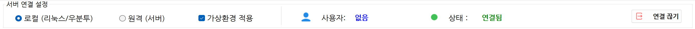

#### 로컬 모드
- Windows 환경에서 DonkeyCar 프로젝트 폴더 선택
- manage.py가 포함된 mycar 폴더를 기준으로 작업 수행
- 로컬 Python 프로세스를 통해 학습 및 테스트 실행

#### 원격 모드
- IP, ID, Password 입력 후 SSH 서버 접속
- 로그인 성공 시 원격 서버 경로 자동 설정
- 기본 작업 경로: `/home/사용자명/donkeycar`

#### 원격 연결 관리
- 원격 접속 성공 시 상단 프로필 메뉴에 사용자명 표시
- 원격 서버 로그아웃 기능 제공
- 로컬 모드 전환 시 SSH 연결 종료

### +) 🔑 로그인 및 연동 (LoginForm.cs)
> 원격 서버 환경을 사용하기 위한 로그인 기능을 제공합니다.

- **기능:** IP, 아이디, 비밀번호 입력, 보기/숨기기(마스킹), 모두 지우기 기능.
- **사용성:** Enter 키를 통한 입력 칸 이동 및 자동 로그인 시도.

-----------------------------------------------------------------------------------------------------------------------------------

### 2. 초보자 가이드 및 상단 메뉴
> 프로그램 실행 시 사용 설명서 팝업을 제공합니다.
<table>
<tr>
<td align="center">
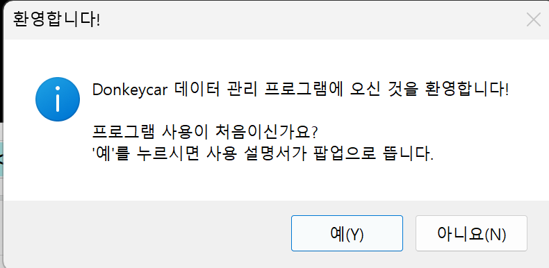
</td>

<td align="center">
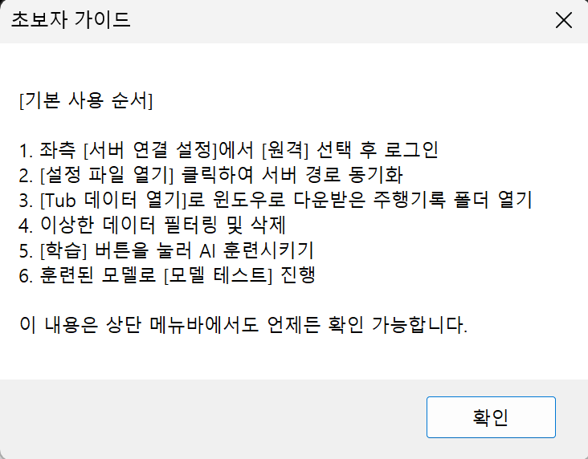
</td>
</tr>

<tr>
<td align="center">
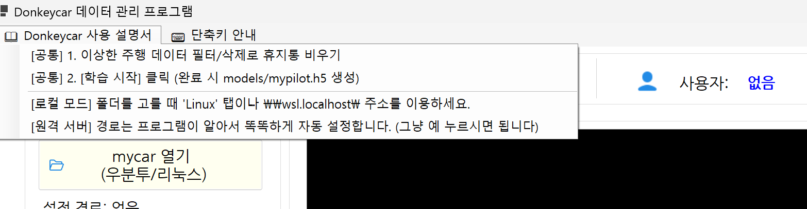
</td>

<td align="center">
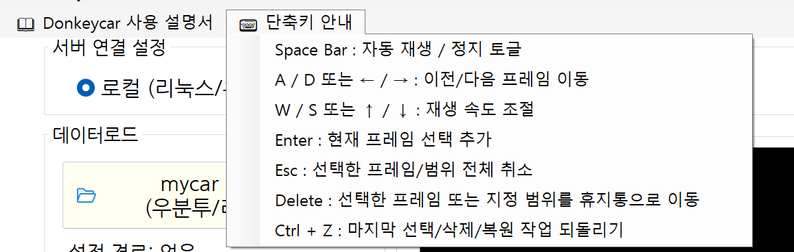
</td>
</tr>
</table>

#### 기본 사용 순서
1. 서버 연결 설정에서 모드 선택 (로컬/원격)
2. 설정 파일 열기로 mycar 폴더 설정
3. Tub 데이터 열기로 주행 데이터 불러오기
4. 데이터 정리 탭에서 이상 데이터 필터링
5. 학습 버튼으로 AI 모델 학습
6. 모델 선택 후 테스트 이미지로 모델 검증

#### 상단 메뉴 구성
- DonkeyCar 사용 설명서
- 단축키 안내
- 로그인 프로필
- 원격 서버 로그아웃

-----------------------------------------------------------------------------------------------------------------------------------

### 3. 가상환경 모드 지원
> 가상환경 사용 여부를 체크박스로 선택할 수 있습니다.

#### 가상환경 ON
- 독립된 Python 환경에서 DonkeyCar 실행
- 패키지 충돌 방지 및 안정성 향상
- 서버 환경 보호
- 권장 실행 방식

#### 가상환경 OFF
- 서버 기본 Python 환경에서 DonkeyCar 실행
- 패키지 충돌 가능성 안내
- 경고 팝업 표시

-----------------------------------------------------------------------------------------------------------------------------------

### 4. DonkeyCar 설정 폴더 로드
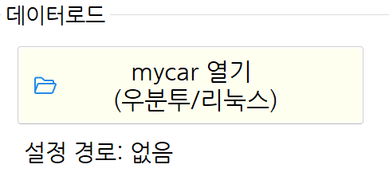

#### 로컬 모드
- 사용자가 직접 manage.py가 있는 mycar 폴더를 선택하여 설정 파일을 로드

#### 원격 모드
- 로그인한 사용자명을 기준으로 서버 경로를 자동 설정 `/home/{username}/mycar`

-----------------------------------------------------------------------------------------------------------------------------------

### 📂 5. Tub 데이터 로딩 기능
> DonkeyCar 주행 데이터 폴더를 선택하면 프레임 정보를 자동으로 읽습니다.
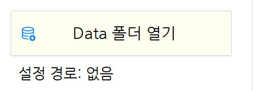
#### 지원하는 Tub 형식
##### 📄 신버전 Tub 
`catalog_*.catalog`
##### 📄 구버전 Tub
`record_*.json`

#### 자동 처리 기능
- 하위 폴더까지 자동 검색
- catalog 파일 숫자 순으로 자동 정렬
- record JSON 파일 숫자 순으로 정렬
- 이미지 경로 자동 탐색
- 프레임 번호, 조향각, 속도 데이터 추출 (+ 전체 프레임 개수 계산)
- 누락 이미지 자동 감지

-----------------------------------------------------------------------------------------------------------------------------------

### 🎬 6. 프레임 탐색 기능 
> Tub 데이터를 불러오면 주행 프레임을 화면에서 탐색할 수 있습니다.
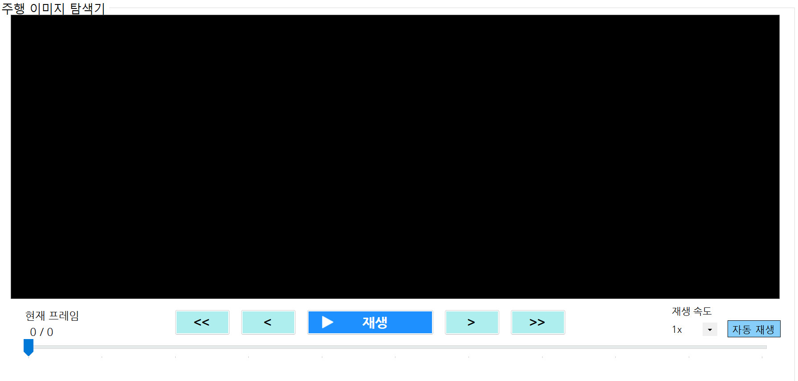

#### 지원 기능
##### ▶️ 프레임 이동
- 첫 프레임 이동
- 이전 프레임 이동
- 다음 프레임 이동
- 마지막 프레임 이동
##### 🎚️ 트랙바 이동
- TrackBar 기반 프레임 이동
- 특정 위치 즉시 이동
- 현재 위치 표시
##### 📋 프레임 목록 이동
- 프레임 번호 리스트 클릭 시 해당 프레임으로 이동
- 현재 프레임 자동 동기화
- 삭제 프레임 목록에서 제외
- 프레임 번호, 조향각, 속도 정보 실시간 표시

-----------------------------------------------------------------------------------------------------------------------------------
### 7. 🖱️ 화면 크기 조절 기능
> 주행 이미지 탐색기 영역의 크기를 마우스로 조절할 수 있습니다.

#### 지원 기능
- 마우스 드래그로 영역 크기 조절
- 최소 / 최대 크기 제한
- 
-----------------------------------------------------------------------------------------------------------------------------------

### 8. 🖼️타임라인 썸네일 뷰어	`⭐ 신규 기능`
> 주행 데이터를 영상 편집 프로그램과 유사한 방식으로 확인할 수 있도록 구현하였습니다.
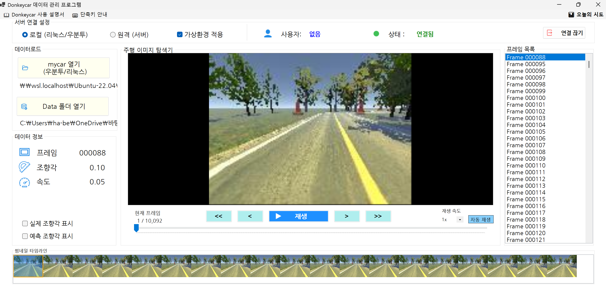

#### 주요 특징
##### 📸 썸네일 생성
- 프레임 번호 순서대로 썸네일 생성
- 현재 프레임 기준 자동 갱신
- 현재 프레임 강조 표시 (테두리 또는 배경색 변경)
##### 🖱️ 썸네일 탐색
- 썸네일 클릭 시 해당 프레임으로 이동 
- 현재 위치 표시
- 자동 재생 동기화
##### 🎯 다중 선택
- Ctrl + 클릭으로 다중 프레임 선택 가능
- Shift로 범위 선택
- 드래그 선택
- Enter 연속 선택

-----------------------------------------------------------------------------------------------------------------------------------

### ▶️ 9. 자동 재생 기능
> 주행 데이터를 영상처럼 연속으로 재생할 수 있습니다.

#### 지원 기능
- 재생 / 정지 토글 버튼
- 자동 반복 재생 ( 반복 재생 btn )
- 재생 속도 조절
- 삭제된 프레임 자동 건너뛰기
- 고배속 재생 시 프레임 단위 이동 최적화

-----------------------------------------------------------------------------------------------------------------------------------

### 10. 🧹 데이터 정리 기능 
> 주행 데이터에서 학습에 방해되는 프레임을 필터링할 수 있습니다.

#### 지원 기능
- 📍 범위 지정: 왼쪽, 오른쪽 범위 설정 가능 ( 범위 미지정 시 전체 데이터 대상 )
- 🔍 필터 조건: 속도 0 프레임, 이미지 누락 프레임, 비정상 조향각 프레임
- 🎯 선택 삭제: 선택한 프레임을 휴지통으로 이동

####  🗑️ 휴지통 시스템`⭐ 신규 기능`
> 실수로 데이터를 삭제하더라도 복구할 수 있도록 휴지통 기반 삭제 방식을 사용합니다.

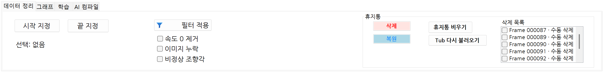

#### 지원 기능
- 🗑️ 휴지통 이동
- ♻️ 복원
- ❌ 영구 삭제 ( 휴지통 비우기 ) ( 삭제 전 확인-> 영구 삭제 처리 )

##### 장점
- 실수로 삭제한 프레임 복구 가능
- 실제 파일 삭제 전에 검토 기회 제공
- 안전한 데이터 정리 가능

-----------------------------------------------------------------------------------------------------------------------------------

### 11. 실제 조향각 / 예측 조향각 표시
> 프레임 이미지 위에 조향각 선을 시각 적으로 표시힙니다.
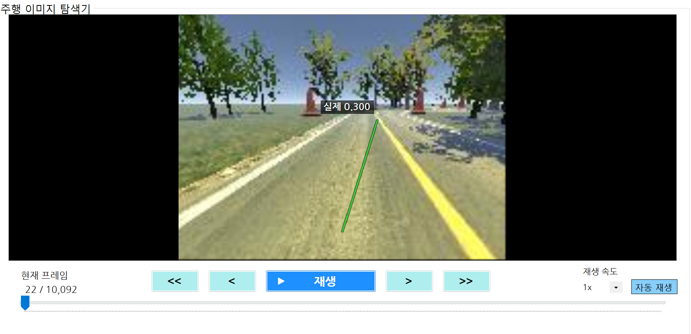

#### 실제 조향각
- 초록색 선으로 표시
- Tub 데이터의 `user_angle` 값 사용

#### 예측 조향각
- 파란색 선으로 표시
- 모델 테스트 결과에서 추출한 예측값 사용

#### 표시 정보
- 조향각 방향
- 조향각 수치
- 실제값 / 예측값 비교

-----------------------------------------------------------------------------------------------------------------------------------

### 12. 🤖 AI 모델 학습 기능
> DonkeyCar 프로젝트 경로를 기준으로 AI 모델 학습을 실행합니다.

> 사용자는 복잡한 터미널 명령어 없이 버튼 클릭으로 AI 모델 학습을 시작하고 진행 상황을 확인할 수 있습니다.

#### 학습 전 검사
> 학습 실행 전 필수 설정이 완료되었는지 확인합니다.
##### 📋 실행 환경 확인
- 실행기 설정 여부 확인 (로컬/원격)
- DonkeyCar 설정 경로 확인
- Tub 데이터 로드 여부 확인
- 학습 가능 상태 확인
##### ⚠️ 오류 방지
- 데이터 누락 여부 확인
- 경로 설정 오류 감지
- 잘못된 
- 사용자 확인 팝업 표시

#### 학습 중 지원 기능
##### 📈 실시간 진행률 표시
- Epoch 진행률 계산
- ProgressBar 갱신
- 현재 학습 상태 표시
- 학습 완료 감지

##### 📝 실시간 로그 출력
- 학습 로그 출력
- Epoch 정보 출력
- Loss 정보 출력
- 학습 상태 출력
- 오류 + 완료 메시지 출력

#### 학습 완료 시
> 학습이 완료되면 생성된 모델을 테스트 탭의 기본 모델로 자동 설정합니다.

- 기본 모델 위치: `models/mypilot.h5`

-----------------------------------------------------------------------------------------------------------------------------------

#### 13. ⛔ 학습 / 테스트 중지 기능
> 실행 중인 작업을 사용자가 버튼을 통해 직접 중지할 수 있습니다.
##### 지원 기능
- 학습 중지 + 테스트 중지 버튼 제공
- 진행 상태 초기화 (UI 상태 복구, 로그 출력)
- 원격 SSH 연결은 유지한 채 실행 중인 Python 프로세스만 안전하게 종료 (Ctrl+C 인터페이스 활용)

-----------------------------------------------------------------------------------------------------------------------------------

### 14. 🧪 모델 테스트 기능

  

#### 모델 선택
##### 원격 모드
- 기본 모델을 자동 선택합니다. `models/mypilot.h5`

##### 로컬 모드
- 사용자가 직접 .h5 모델 파일을 선택합니다. `*.h5`

#### 테스트 이미지 선택
- 테스트 이미지 선택 버튼 제공
- 테스트 이미지 미리 보기 가능 ( pictureBox )

#### 테스트 결과 표시
##### 출력 정보
- 실제 조향각
- 예측 조향각
- 오차값
###### 결과 확인
- 테스트 상태 표시 ( 테스트 중, 테스트 완료, 오류 발생 )
- 오차가 큰 데이터는 별도로 표시하여 분석할 수 있도록 지원

-----------------------------------------------------------------------------------------------------------------------------------

### 15. 🎯 실제 조향각 / 예측 조향각 비교
> 모델 테스트 결과에서 실제 조향각과 예측 조향각을 시각적으로 비교할 수 있도록 구현하였습니다.
#### 지원 기능
- 실제 조향각과 예측 조향각을 이미지 위에 선으로 표시
- 조향각 수치 표시
- 실제값과 예측값의 차이를 시각적으로 구분 (예: 색상, 선 굵기)
- 오차값 표시 및 분석

---------------------------------------------------------------------------------------------------------------------------------
### 16. 🧠 AI 컴파일 기능

  

> 모델 테스트 결과를 바랑으로 오차가 큰 프레임을 분석하는 기능입니다.

#### 실행 조건
> AI 컴파일을 실행하기 위해서는 다음 조건이 필요합니다.

#### 필수 조건
- 모델 테스트가 완료되어야 합니다.
- 실제 조향각과 예측 조향각 데이터가 존재해야 합니다.
- Tub 데이터가 로드되어 있어야 합니다.

#### 분석 대상
| 항목 | 설명 |
|------|------|
| 실제 조향각 | 실제 데이터 |
| 예측 조향각 | 모델 예측 결과 |
| 오차값 | 실제값과 예측값의 차이 |

#### 지원 기능
#### 📋 오차 프레임 목록
- 오차값이 큰 프레임을 목록으로 표시
- 프레임 정보 표시

#### 🎯 프레임 이동
- 선택 프레임 이동
- 해당 이미지 확인

#### 🗑️ 데이터 정리
- 오차가 큰 프레임을 데이터 정리 탭으로 이동하여 필터링 가능
- 오차 프레임을 휴지통으로 이동하여 학습에서 제외 가능

---------------------------------------------------------------------------------------------------------------------------------

⚡ 2026-06-12 변경 사항 (v1.2.0) - MLOps 기능 정리 최종본
비동기 듀얼 로깅 및 자동 백업 시스템 도입:

ConcurrentQueue와 50ms UI 렌더링 타이머를 결합한 생산자-소비자(Producer-Consumer) 패턴을 적용하여, 수만 줄의 파이썬 스트리밍 로그 발생 시 윈도우 UI가 멈추는 프리징(Freezing) 현상을 완벽히 차단.

런타임에 정크 문자(\r, ==== 등)를 필터링하고, 주요 키워드(Epoch, Loss, Error)를 캐치하여 요약 로그와 원본 로그로 채널을 분리 출력 (UI 시인성 극대화).

작업 완료 및 강제 중지 시, 바탕화면에 Donkeycar_Logs 전용 폴더를 자동 생성하고 타임스탬프 기반으로 로그를 영구 보존하는 아카이빙 기능 추가.

AI 컴파일러 기반 오답 노트(피드백 루프) 구현:

모델 테스트(eval_model.py) 종료 직후, C# 정규식 파서가 실제 조향각(Real)과 예측 조향각(Predict)을 대조하여 오차 절대값이 0.1 이상인 불량 쓰레기 프레임을 자동 색출.

오차가 큰 순서대로 내림차순 정렬된 리스트(lstHighErrorFrames)를 제공하며, 클릭 시 즉각적인 뷰어 연동 및 원클릭 삭제(휴지통 이동)를 지원하여 모델 성능을 비약적으로 높이는 MLOps 선순환 구조 완성.

무결점 프로세스 제어 및 환경 자동 구축 (Zero-Hardcoding):

단순 UI 종료를 넘어, 강제 중지(Cancel()) 시 리눅스 커널에 pkill -f 명령을 직접 주입하여 train.py 및 eval_model.py의 자식/좀비 프로세스로 인한 서버 메모리 누수를 완벽 차단.

딥러닝 구동 전 conda activate를 통한 가상환경 샌드박스 진입, 파이썬 3.11+ MRO 충돌 에러 동적 패치, 누락된 패키지(imgaug, numpy<2.0) 백그라운드 자동 설치 로직 적용.

사용자별 설치 경로, 데이터 폴더 구조를 C#에서 리눅스 마운트 경로로 실시간 정규식 변환하여 주입하는 제로 하드코딩 달성.

반응형 UI 최적화 및 렌더링 개선:

픽셀 기반 수동 레이아웃 연산 충돌로 인한 해상도 찌그러짐 현상을 윈폼 네이티브 Anchor 속성으로 전면 교체하여 부드러운 반응형(Responsive) 환경 구축.

테스트 탭 UI를 불필요한 이중 창에서 직관적인 싱글 원본 뷰어 폼으로 간소화 및 레이아웃 재배치.

🏗️ 아키텍처 상세 (업데이트)
ICommandExecutor: 로컬(WSL) 및 원격(SSH) 환경 상관없이, 파이썬 스크립트 파일을 C# 내부에서 Base64로 인코딩한 뒤 리눅스 런타임 임시 폴더에 동적 주입 및 소멸시키는(Atomic Execution) 패턴 적용.

Log Parsing & Throttling: 실시간 데이터 파싱 정밀도 향상 및 Queue를 활용한 렌더링 스로틀링(Throttling) 제어로 극한의 멀티스레드 안정성 확보.

🚧 TODO & FIXME (향후 작업)
향후 계획:

원격 접속 세션(SSH) 관리용 Keep-alive 핑(Ping) 로직 구현.

로그 뷰어 차트(Loss, Angle/Throttle)의 렌더링 성능 최적화.

초대용량 Tub 데이터 로딩 시 I/O 병렬 처리 속도 개선.

---------------------------------------------------------------------------------------------------------------------------------

### ⚡ 2026-05-26 변경 사항 (v1.1.0) - 범용성 강화 및 UX 고도화
- **범용 학습 환경 자동 구축 (Zero-Hardcoding):**
  - 사용자별 설치 경로, 데이터 폴더 구조(`data`, `data/data3` 등)를 쉘 스크립트로 자동 탐색하여 유연하게 적용.
  - 파이썬 최신 버전(3.11+) MRO 충돌 에러 자동 패치 및 누락된 패키지(`imgaug`, `numpy` 호환성) 백그라운드 자동 설치 로직 적용.
- **학습 상태 모니터링 및 UX 개선:**
  - 조기 종료(Early Stopping) 감지 로직 추가 및 학습 완료 시 로그 창 시각적 구분선(`---`) 처리.
  - 진행률 바(ProgressBar)가 세부 Batch 단위에 반응하여 널뛰는 버그 수정 (전체 Epoch 정규식 매칭 고도화).
  - 완료 시 사용자에게 다음 행동(모델 테스트 등)을 직관적으로 안내하는 가이드 팝업 알림 추가.
- **작업 강제 중지 기능 구현:**
  - SSH 세션 연결은 유지한 채 실행 중인 파이썬 프로세스만 안전하게 종료(Ctrl+C)하는 `Cancel()` 인터페이스 및 UI 버튼 연동.

### 🏗️ 아키텍처 상세 (업데이트)
- **ICommandExecutor:** `Cancel()` 메서드 확장을 통한 프로세스 세밀 제어 기능 추가.
- **Log Parsing:** 실시간 스트리밍 데이터 파싱 정밀도 향상 및 예외/완료 상태 감지 분기 고도화.

### 🚧 TODO & FIXME (향후 작업)
- **향후 계획:**
  - 원격 접속 세션 관리(Keep-alive) 로직 구현.
  - 로그 뷰어 차트의 렌더링 성능 최적화.

-----------------------------------------------------------------------------------------------------------------------------------

 ### 📋 2026-05-25 업데이트 사항 (v1.0.1)
- **UI/UX 개선:** 유저 친화적인 UI 구성 및 상단바 레이아웃 최적화.
- **버그 수정:** AI 학습 모듈 및 모델 테스트 단계에서 발생하던 오류 해결.
- **아키텍처:** 로컬/원격(SSH) 실행 인터페이스(`ICommandExecutor`) 기반의 통합 구조 구현.

### 🏗️ 아키텍처 상세
-- **통합 인터페이스:** `ICommandExecutor`를 통해 로컬(Python 프로세스)과 원격(SSH.NET) 실행 방식을 추상화하여 통일.
- **RemoteExecutor:** `SshClient`와 `ShellStream`을 이용한 실시간 로그 스트리밍 구현.
- **LocalExecutor:** `Process` 객체를 활용한 로컬 파이썬 실행 및 로그 파싱 구현.

### 🔑 로그인 및 연동
- **기능:** IP, 아이디, 비밀번호 입력, 보기/숨기기(마스킹), 모두 지우기 기능.
- **사용성:** Enter 키를 통한 입력 칸 이동 및 자동 로그인 시도.
- **데이터:** 로그인 정보 로컬 파일 저장(Persistence) 및 워터마크(Placeholder)/에러 메시지 출력.

### 🖥️ UI 연동 (Form1.cs)
- **모드 전환:** 라디오 버튼을 통한 로컬/원격 모드 전환.
- **안전성:** 원격 모드 선택 시 로그인 폼 호출, 성공 시 `_executor` 자동 세팅 및 취소 시 로컬 모드로 자동 복구되는 UI 흐름 설계.
- **데이터 시각화:** 실시간 로그 파싱 및 차트 데이터 갱신 구조 완성.
 
-----------------------------------------------------------------------------------------------------------------------------------

cf) 
#### 🏗️ 아키텍처 설계 (ICE.cs)
- **통합 인터페이스:** `ICommandExecutor`를 통해 로컬(Python 프로세스)과 원격(SSH.NET) 실행 방식을 추상화하여 통일.
- **RemoteExecutor:** `SshClient`와 `ShellStream`을 이용한 실시간 로그 스트리밍 구현.
- **LocalExecutor:** `Process` 객체를 활용한 로컬 파이썬 실행 및 로그 파싱 구현.
